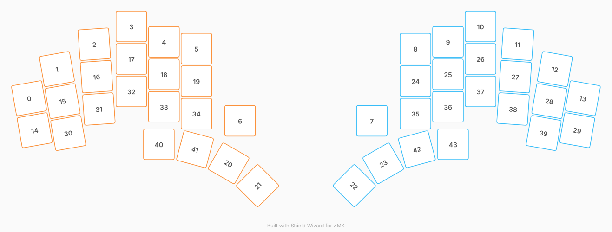

# ZMK Configuration for klon-dongle

*Generated by Shield Wizard for ZMK*



Download compiled firmware from the Actions tab. <https://zmk.dev/docs/user-setup#installing-the-firmware>

Edit your keymap <https://zmk.dev/docs/keymaps>.
User keymap is located at [`config/klon_dongle.keymap`](config/klon_dongle.keymap).

-----

<details>
<summary>
Shield Wizard Debug Information
</summary>

In case of broken configuration, here is the Shield Wizard internal data used to generate this configuration:

Commit: 84a348b08cf4fec4a5441a46147e9a345b10ffab

```json
{"name":"klon-dongle","shield":"klon_dongle","dongle":true,"modules":[],"layout":[{"id":"01M27GH9XEEF37Q9QSC0DBBDPN","part":0,"row":0,"col":0,"w":1,"h":1,"x":0.079,"y":2.211,"r":-10,"rx":0.579,"ry":2.711},{"id":"01M27GH9XFPQBFN1HYQY6QHDMG","part":0,"row":0,"col":1,"w":1,"h":1,"x":0.936,"y":1.312,"r":-10,"rx":1.436,"ry":1.812},{"id":"01M27GH9XGDAPKKQYTJ5ATZ4B7","part":0,"row":0,"col":2,"w":1,"h":1,"x":2.085,"y":0.547,"r":-4,"rx":2.585,"ry":1.047},{"id":"01M27GH9XGYTPPN9PCFZRZHZEA","part":0,"row":0,"col":3,"w":1,"h":1,"x":3.225,"y":0,"r":0,"rx":0,"ry":0},{"id":"01M27GH9XFTCTYZZGGM2EVNRKA","part":0,"row":0,"col":4,"w":1,"h":1,"x":4.225,"y":0.474,"r":0,"rx":0,"ry":0},{"id":"01M27GH9XG6C5RBZZ6DVNJ57H3","part":0,"row":0,"col":5,"w":1,"h":1,"x":5.225,"y":0.684,"r":0,"rx":0,"ry":0},{"id":"01M27GH9XFP51B7AEZ22CT0QH1","part":0,"row":0,"col":6,"w":1,"h":1,"x":6.566,"y":2.905,"r":0,"rx":0,"ry":0},{"id":"01M27GH9XFP3KCMG9ZZVD12MCP","part":1,"row":0,"col":8,"w":1,"h":1,"x":10.617,"y":2.905,"r":0,"rx":0,"ry":0},{"id":"01M27GH9XG7GYQ0BMW9VF07V68","part":1,"row":0,"col":10,"w":1,"h":1,"x":11.958,"y":0.684,"r":0,"rx":0,"ry":0},{"id":"01M27GH9XG5V3T53J984Y0DBRF","part":1,"row":0,"col":11,"w":1,"h":1,"x":12.958,"y":0.474,"r":0,"rx":0,"ry":0},{"id":"01M27GH9XGKEE8Y3KRWC13GZFS","part":1,"row":0,"col":12,"w":1,"h":1,"x":13.958,"y":0,"r":0,"rx":0,"ry":0},{"id":"01M27GH9XG2Y9ZJTHBZKNXGQYG","part":1,"row":0,"col":13,"w":1,"h":1,"x":15.097,"y":0.547,"r":4,"rx":15.597,"ry":1.047},{"id":"01M27GH9XG1MFVYAQHNAVNCH3T","part":1,"row":0,"col":14,"w":1,"h":1,"x":16.246,"y":1.312,"r":10,"rx":16.746,"ry":1.812},{"id":"01M27GH9XF32QT2V401RDE1VNA","part":1,"row":0,"col":15,"w":1,"h":1,"x":17.103,"y":2.211,"r":10,"rx":17.603,"ry":2.711},{"id":"01M27GH9XF0SRAAT5D3V62JFZM","part":0,"row":1,"col":0,"w":1,"h":1,"x":0.253,"y":3.196,"r":-10,"rx":0.753,"ry":3.696},{"id":"01M27GH9XG27CCZFD5GDT3EQC0","part":0,"row":1,"col":1,"w":1,"h":1,"x":1.11,"y":2.297,"r":-10,"rx":1.61,"ry":2.797},{"id":"01M27GH9XH4K0D9TG1HAE07PJ4","part":0,"row":1,"col":2,"w":1,"h":1,"x":2.155,"y":1.545,"r":-4,"rx":2.655,"ry":2.045},{"id":"01M27GH9XG7YG7KSDD3J4HA496","part":0,"row":1,"col":3,"w":1,"h":1,"x":3.225,"y":1,"r":0,"rx":0,"ry":0},{"id":"01M27GH9XF6HK365RDP28SSV5S","part":0,"row":1,"col":4,"w":1,"h":1,"x":4.225,"y":1.474,"r":0,"rx":0,"ry":0},{"id":"01M27GH9XG26FK65CZXG90JVYR","part":0,"row":1,"col":5,"w":1,"h":1,"x":5.225,"y":1.684,"r":0,"rx":0,"ry":0},{"id":"01M27GH9XG5M3P5YKCPZZFVV51","part":0,"row":1,"col":6,"w":1,"h":1,"x":6.215,"y":4.215,"r":30,"rx":6.715,"ry":4.715},{"id":"01M27GH9XFY9GPPAV0A712740Q","part":0,"row":1,"col":7,"w":1,"h":1,"x":7.103,"y":4.902,"r":-45,"rx":7.603,"ry":5.402},{"id":"01M27GH9XF18NF2DPJY19Z0GP6","part":1,"row":1,"col":8,"w":1,"h":1,"x":10.079,"y":4.902,"r":45,"rx":10.579,"ry":5.402},{"id":"01M27GH9XG93Y2TQMESH9D9ZME","part":1,"row":1,"col":9,"w":1,"h":1,"x":10.967,"y":4.215,"r":-30,"rx":11.467,"ry":4.715},{"id":"01M27GH9XG1BME7V2G8DM9WEA5","part":1,"row":1,"col":10,"w":1,"h":1,"x":11.958,"y":1.684,"r":0,"rx":0,"ry":0},{"id":"01M27GH9XFBBPSN79ZPHKH0K4X","part":1,"row":1,"col":11,"w":1,"h":1,"x":12.958,"y":1.474,"r":0,"rx":0,"ry":0},{"id":"01M27GH9XGVAX5WZN46BEAJT7X","part":1,"row":1,"col":12,"w":1,"h":1,"x":13.958,"y":1,"r":0,"rx":0,"ry":0},{"id":"01M27GH9XHHH165APAWRZ462CW","part":1,"row":1,"col":13,"w":1,"h":1,"x":15.027,"y":1.545,"r":4,"rx":15.527,"ry":2.045},{"id":"01M27GH9XHYSDDM6BJB28VJQJ6","part":1,"row":1,"col":14,"w":1,"h":1,"x":16.073,"y":2.297,"r":10,"rx":16.573,"ry":2.797},{"id":"01M27GH9XG787A8CN8Z0ZH6BCZ","part":1,"row":1,"col":15,"w":1,"h":1,"x":16.93,"y":3.196,"r":10,"rx":17.43,"ry":3.696},{"id":"01M27GH9XF30T5G1F44FSYJF08","part":0,"row":2,"col":1,"w":1,"h":1,"x":1.283,"y":3.281,"r":-10,"rx":1.783,"ry":3.781},{"id":"01M27GH9XG5WAR82BXE8YYCK9D","part":0,"row":2,"col":2,"w":1,"h":1,"x":2.225,"y":2.542,"r":-4,"rx":2.725,"ry":3.042},{"id":"01M27GH9XFA3NCPBAMKYVYM42Z","part":0,"row":2,"col":3,"w":1,"h":1,"x":3.225,"y":2,"r":0,"rx":0,"ry":0},{"id":"01M27GH9XH0PW8MXGZ90HFJM3C","part":0,"row":2,"col":4,"w":1,"h":1,"x":4.225,"y":2.474,"r":0,"rx":0,"ry":0},{"id":"01M27GH9XG2MMSFA5N81GE7QR8","part":0,"row":2,"col":5,"w":1,"h":1,"x":5.225,"y":2.684,"r":0,"rx":0,"ry":0},{"id":"01M27GH9XGQTZVQFQFSASD8DSJ","part":1,"row":2,"col":10,"w":1,"h":1,"x":11.958,"y":2.684,"r":0,"rx":0,"ry":0},{"id":"01M27GH9XH9YE41ZA3DZCPFWCY","part":1,"row":2,"col":11,"w":1,"h":1,"x":12.958,"y":2.474,"r":0,"rx":0,"ry":0},{"id":"01M27GH9XFH05M3NAA68GZN966","part":1,"row":2,"col":12,"w":1,"h":1,"x":13.958,"y":2,"r":0,"rx":0,"ry":0},{"id":"01M27GH9XGQDMY30W12V8JFXSZ","part":1,"row":2,"col":13,"w":1,"h":1,"x":14.958,"y":2.542,"r":4,"rx":15.458,"ry":3.042},{"id":"01M27GH9XFSZ39ABBD8Z8FSX5Z","part":1,"row":2,"col":14,"w":1,"h":1,"x":15.899,"y":3.281,"r":10,"rx":16.399,"ry":3.781},{"id":"01M27GH9XFYWJNSQ8X38T3HCP0","part":0,"row":3,"col":4,"w":1,"h":1,"x":4.07,"y":3.629,"r":0,"rx":0,"ry":0},{"id":"01M27GH9XHEPTD7CJX9JDY252M","part":0,"row":3,"col":5,"w":1,"h":1,"x":5.181,"y":3.781,"r":15,"rx":5.681,"ry":4.281},{"id":"01M27GH9XHSTJPJZFFC9KJ7W26","part":1,"row":3,"col":10,"w":1,"h":1,"x":12.002,"y":3.781,"r":-15,"rx":12.502,"ry":4.281},{"id":"01M27GH9XFQ790ZZ8G6GHYHSTG","part":1,"row":3,"col":11,"w":1,"h":1,"x":13.113,"y":3.629,"r":0,"rx":0,"ry":0}],"parts":[{"name":"left","controller":"nice_nano_v2","pins":{"d1":{"usage":"kscan","kscan":"01M27GW33AAHYPY63JXJFN6ZZK","role":"input"},"d0":{"usage":"kscan","kscan":"01M27GW33AAHYPY63JXJFN6ZZK","role":"input"},"d2":{"usage":"kscan","kscan":"01M27GW33AAHYPY63JXJFN6ZZK","role":"input"},"d3":{"usage":"kscan","kscan":"01M27GW33AAHYPY63JXJFN6ZZK","role":"input"},"d4":{"usage":"kscan","kscan":"01M27GW33AAHYPY63JXJFN6ZZK","role":"input"},"d5":{"usage":"kscan","kscan":"01M27GW33AAHYPY63JXJFN6ZZK","role":"input"},"d6":{"usage":"kscan","kscan":"01M27GW33AAHYPY63JXJFN6ZZK","role":"output"},"d7":{"usage":"kscan","kscan":"01M27GW33AAHYPY63JXJFN6ZZK","role":"output"},"d8":{"usage":"kscan","kscan":"01M27GW33AAHYPY63JXJFN6ZZK","role":"output"},"d9":{"usage":"kscan","kscan":"01M27GW33AAHYPY63JXJFN6ZZK","role":"output"},"d10":{"usage":"encoder","encoderId":"01M27GY8M35VFHZ4MC9F72HGWG","role":"pinA"},"d16":{"usage":"encoder","encoderId":"01M27GY8M35VFHZ4MC9F72HGWG","role":"pinB"},"d14":{"usage":"kscan","kscan":"01M27GW33AAHYPY63JXJFN6ZZK","role":"input"}},"kscans":[{"kind":"matrix","id":"01M27GW33AAHYPY63JXJFN6ZZK","diodes":true}],"keys":{"01M27GH9XG6C5RBZZ6DVNJ57H3":{"input":"d1","output":"d6"},"01M27GH9XFTCTYZZGGM2EVNRKA":{"input":"d0","output":"d6"},"01M27GH9XGYTPPN9PCFZRZHZEA":{"input":"d2","output":"d6"},"01M27GH9XGDAPKKQYTJ5ATZ4B7":{"input":"d3","output":"d6"},"01M27GH9XFPQBFN1HYQY6QHDMG":{"input":"d4","output":"d6"},"01M27GH9XG26FK65CZXG90JVYR":{"input":"d1","output":"d7"},"01M27GH9XG2MMSFA5N81GE7QR8":{"input":"d1","output":"d8"},"01M27GH9XFY9GPPAV0A712740Q":{"input":"d1","output":"d9"},"01M27GH9XF6HK365RDP28SSV5S":{"input":"d0","output":"d7"},"01M27GH9XH0PW8MXGZ90HFJM3C":{"input":"d0","output":"d8"},"01M27GH9XG5M3P5YKCPZZFVV51":{"input":"d0","output":"d9"},"01M27GH9XG7YG7KSDD3J4HA496":{"input":"d2","output":"d7"},"01M27GH9XFA3NCPBAMKYVYM42Z":{"input":"d2","output":"d8"},"01M27GH9XHEPTD7CJX9JDY252M":{"input":"d2","output":"d9"},"01M27GH9XH4K0D9TG1HAE07PJ4":{"input":"d3","output":"d7"},"01M27GH9XG5WAR82BXE8YYCK9D":{"input":"d3","output":"d8"},"01M27GH9XFYWJNSQ8X38T3HCP0":{"input":"d3","output":"d9"},"01M27GH9XG27CCZFD5GDT3EQC0":{"input":"d4","output":"d7"},"01M27GH9XF30T5G1F44FSYJF08":{"input":"d4","output":"d8"},"01M27GH9XEEF37Q9QSC0DBBDPN":{"input":"d5","output":"d7"},"01M27GH9XF0SRAAT5D3V62JFZM":{"input":"d5","output":"d8"},"01M27GH9XFP51B7AEZ22CT0QH1":{"input":"d14","output":"d8"}},"encoders":[{"id":"01M27GY8M35VFHZ4MC9F72HGWG"}],"buses":{}},{"name":"right","controller":"nice_nano_v2","pins":{"d1":{"usage":"kscan","kscan":"01M27GKZQZSC4Z21TV680XQV0K","role":"input"},"d0":{"usage":"kscan","kscan":"01M27GKZQZSC4Z21TV680XQV0K","role":"input"},"d2":{"usage":"kscan","kscan":"01M27GKZQZSC4Z21TV680XQV0K","role":"input"},"d3":{"usage":"kscan","kscan":"01M27GKZQZSC4Z21TV680XQV0K","role":"input"},"d4":{"usage":"kscan","kscan":"01M27GKZQZSC4Z21TV680XQV0K","role":"input"},"d5":{"usage":"kscan","kscan":"01M27GKZQZSC4Z21TV680XQV0K","role":"input"},"d6":{"usage":"kscan","kscan":"01M27GKZQZSC4Z21TV680XQV0K","role":"output"},"d7":{"usage":"kscan","kscan":"01M27GKZQZSC4Z21TV680XQV0K","role":"output"},"d8":{"usage":"kscan","kscan":"01M27GKZQZSC4Z21TV680XQV0K","role":"output"},"d9":{"usage":"kscan","kscan":"01M27GKZQZSC4Z21TV680XQV0K","role":"output"},"d10":{"usage":"encoder","encoderId":"01M27GZ8BQ24QGJYZ5C99076AJ","role":"pinA"},"d16":{"usage":"encoder","encoderId":"01M27GZ8BQ24QGJYZ5C99076AJ","role":"pinB"},"d14":{"usage":"kscan","kscan":"01M27GKZQZSC4Z21TV680XQV0K","role":"input"}},"kscans":[{"kind":"matrix","id":"01M27GKZQZSC4Z21TV680XQV0K","diodes":true}],"keys":{"01M27GH9XG7GYQ0BMW9VF07V68":{"input":"d1","output":"d6"},"01M27GH9XG1BME7V2G8DM9WEA5":{"input":"d1","output":"d7"},"01M27GH9XGQTZVQFQFSASD8DSJ":{"input":"d1","output":"d8"},"01M27GH9XF18NF2DPJY19Z0GP6":{"input":"d1","output":"d9"},"01M27GH9XG5V3T53J984Y0DBRF":{"input":"d0","output":"d6"},"01M27GH9XFBBPSN79ZPHKH0K4X":{"input":"d0","output":"d7"},"01M27GH9XH9YE41ZA3DZCPFWCY":{"input":"d0","output":"d8"},"01M27GH9XG93Y2TQMESH9D9ZME":{"input":"d0","output":"d9"},"01M27GH9XGKEE8Y3KRWC13GZFS":{"input":"d2","output":"d6"},"01M27GH9XGVAX5WZN46BEAJT7X":{"input":"d2","output":"d7"},"01M27GH9XFH05M3NAA68GZN966":{"input":"d2","output":"d8"},"01M27GH9XHSTJPJZFFC9KJ7W26":{"input":"d2","output":"d9"},"01M27GH9XG2Y9ZJTHBZKNXGQYG":{"input":"d3","output":"d6"},"01M27GH9XHHH165APAWRZ462CW":{"input":"d3","output":"d7"},"01M27GH9XGQDMY30W12V8JFXSZ":{"input":"d3","output":"d8"},"01M27GH9XFQ790ZZ8G6GHYHSTG":{"input":"d3","output":"d9"},"01M27GH9XG1MFVYAQHNAVNCH3T":{"input":"d4","output":"d6"},"01M27GH9XHYSDDM6BJB28VJQJ6":{"input":"d4","output":"d7"},"01M27GH9XFSZ39ABBD8Z8FSX5Z":{"input":"d4","output":"d8"},"01M27GH9XF32QT2V401RDE1VNA":{"input":"d5","output":"d7"},"01M27GH9XG787A8CN8Z0ZH6BCZ":{"input":"d5","output":"d8"},"01M27GH9XFP3KCMG9ZZVD12MCP":{"input":"d14","output":"d8"}},"encoders":[{"id":"01M27GZ8BQ24QGJYZ5C99076AJ"}],"buses":{}}]}
```

</details>
